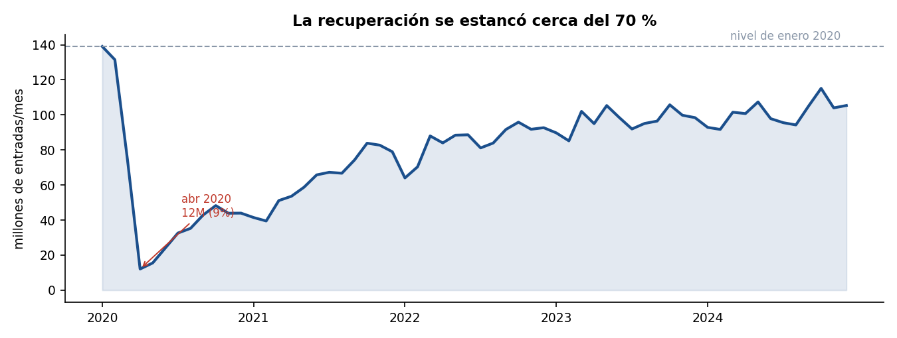
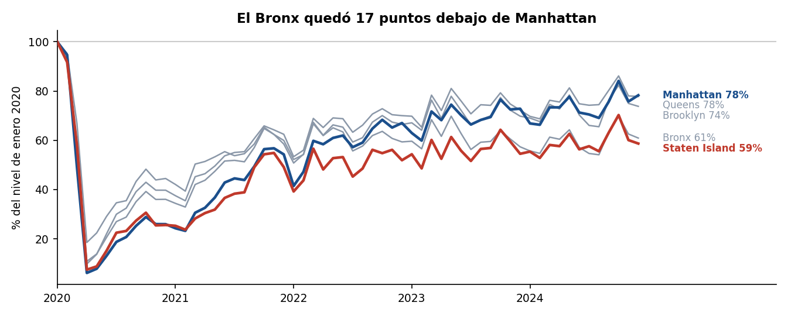
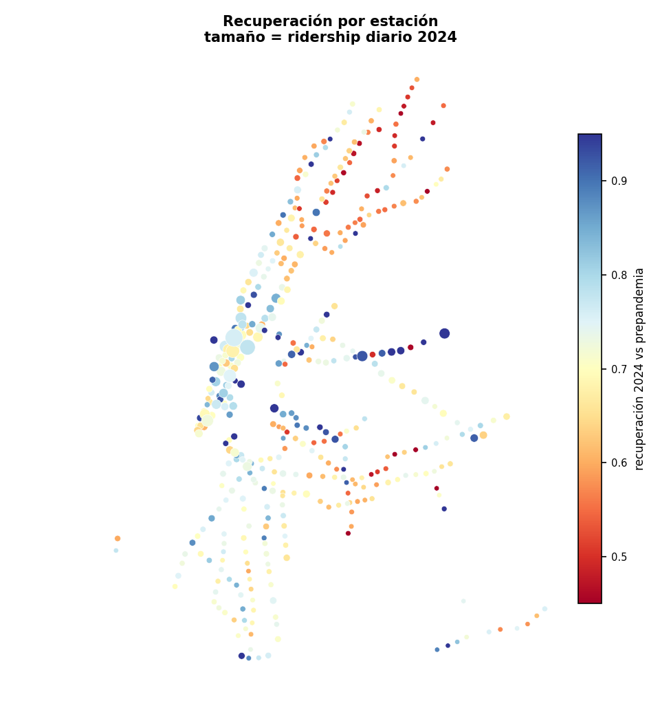
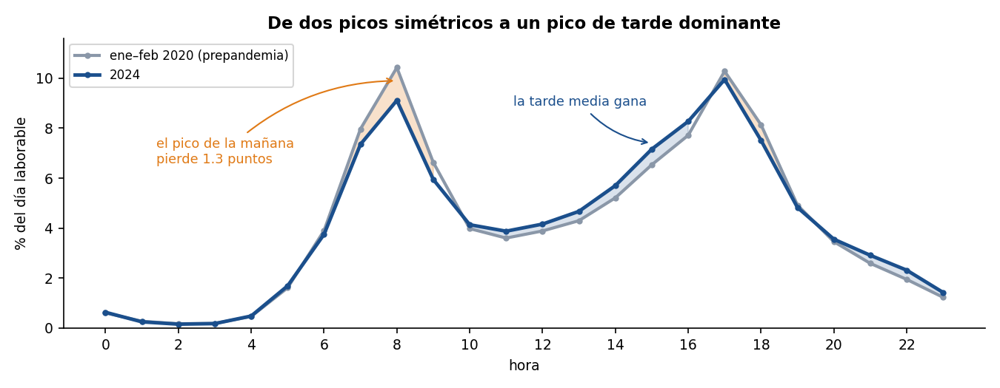
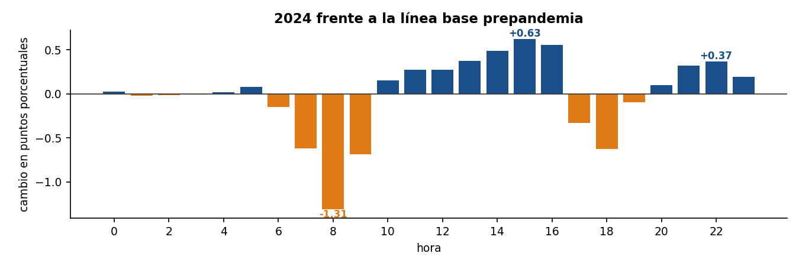
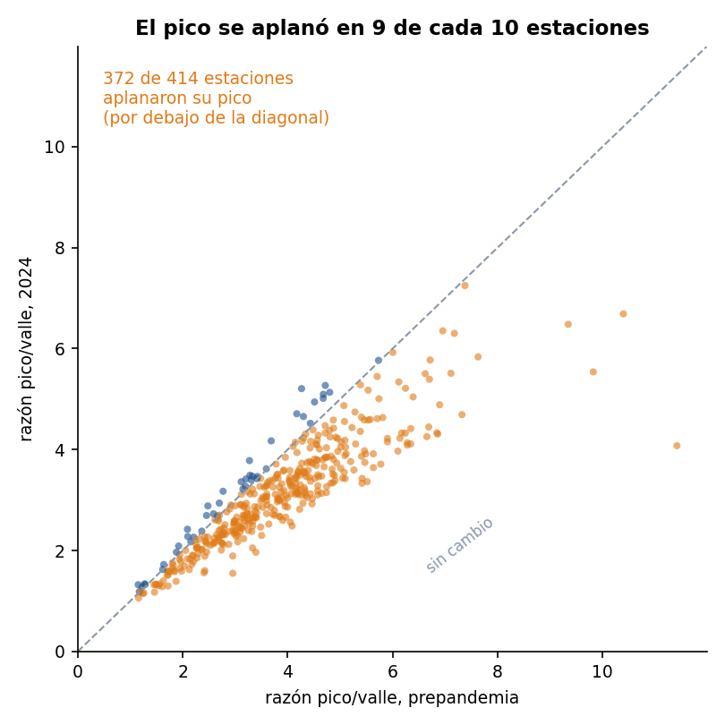
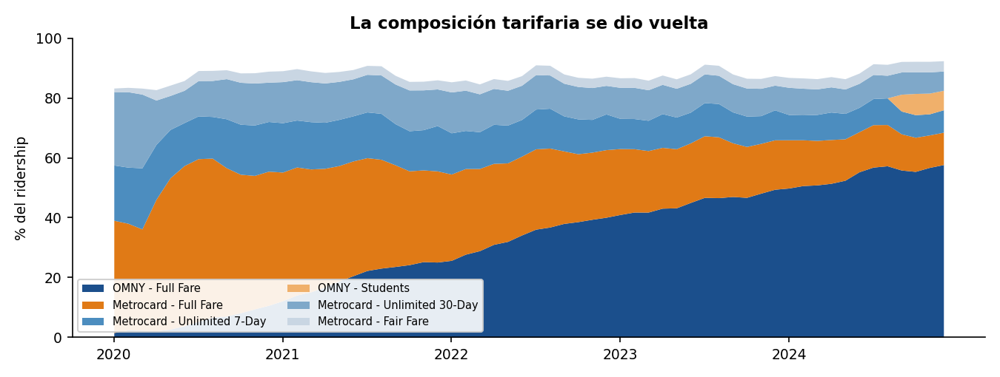

# Análisis de datos y diseño de vistas

**DS5343 Data Visualization · UTEC · 2026-2 · Entrega Semana 6**
Proyecto: *La forma del día — cómo cambió el ritmo horario del metro de Nueva York, 2020–2024*

Renzo Acervo Correa · Stewart Maquera Bobadilla · José Condori Palomino

---

## 1. Comprensión de los datos

El dataset es MTA Subway Hourly Ridership 2020–2024 (`wujg-7c2s`, Open NY). La unidad de registro es una combinación de hora, complejo de estación, modo, método de pago y clase tarifaria, con el conteo de entradas.

Antes de agregar nada verificamos el supuesto del que depende todo el proyecto: que `station_complex_id` sea estable a lo largo de los cinco años. Si los identificadores cambiaran, comparar una estación entre 2020 y 2024 no tendría sentido.

Consultamos cuatro ventanas de siete días por año (febrero, mayo, agosto y noviembre) y comparamos los conjuntos de identificadores.

| Año | Complejos distintos |
|---|---|
| 2020 | 428 |
| 2021 | 428 |
| 2022 | 428 |
| 2023 | 428 |
| 2024 | 428 |

**428 complejos, presentes los cinco años, sin un solo cambio de nombre.** El riesgo que habíamos marcado como principal en la propuesta no se materializó, y el análisis puede usar el conjunto completo sin filtrar.

Detalle en [`docs/station_id_stability.md`](../../docs/station_id_stability.md).

---

## 2. Transformaciones

El archivo completo supera los gigabytes, así que no se descarga: se agrega del lado del servidor con consultas SoQL contra la API de Socrata.

### Por qué ventanas de siete días

La primera versión del pipeline agregaba por mes y expiraba. Medimos el comportamiento real de la API con `date_trunc_ymd` en el `$group`:

| Rango | Resultado |
|---|---|
| 1 día | 0.9 s |
| 7 días | 2.0 s |
| 1 mes | expira a los 600 s |

No es una degradación gradual: hay un precipicio entre una semana y un mes. Socrata cambia de plan de ejecución y cae a una ruta lenta. Por eso las pasadas que usan expresiones de fecha recorren el período en ventanas de siete días, y solo la pasada que agrupa por columnas crudas puede ir mensual.

### Tablas producidas

| Archivo | Agrupación | Filas |
|---|---|---|
| `ridership_by_station_day.csv` | complejo × día | 780 446 |
| `ridership_by_station_hourofweek_year.csv` | complejo × día de semana × hora × año | 359 442 |
| `ridership_by_month_borough_payment_fare.csv` | mes × borough × pago × tarifa | 2 811 |
| `station_profiles_normalized.csv` | perfiles que suman 1 por estación y año | 359 520 |
| `prepandemia_station_hourofweek.csv` | complejo × dow × hora, ene–feb 2020 | 71 866 |
| `stations_coords.csv` | una fila por complejo, con coordenadas | 428 |

### Derivaciones

**Perfil normalizado.** Cada estación y año se convierte en un vector de 168 valores (24 horas × 7 días) dividido por su propio total. Así las estaciones se comparan por forma y no por tamaño, que es la distinción central del proyecto.

**Línea base prepandemia.** La tabla por año mezcla enero y febrero de 2020 con el confinamiento posterior. Extrajimos por separado el perfil de **enero y febrero de 2020**, que es la línea base real. Esta corrección resultó decisiva, como se explica en la sección 4.

**Razón pico/valle.** Por estación: el máximo del perfil laborable entre las 5 y las 11 h dividido por el mínimo entre las 10 y las 14 h. Se descartan 14 estaciones cuyo máximo cae en el borde de la ventana de búsqueda, donde el índice no es confiable.

**Tasa de recuperación.** Ridership diario promedio de 2024 dividido por el ridership diario promedio de enero–febrero de 2020.

---

## 3. Verificación de calidad

Sobre los agregados:

| Control | Resultado |
|---|---|
| Cobertura de la tabla estación × día | 99.8 % de las 781 956 combinaciones posibles |
| Rango temporal | 2020-01-01 a 2024-12-31, los 1827 días |
| Complejos con coordenadas | 428 de 428 |
| Coordenadas fuera del rango de Nueva York | 0 |
| Complejos asignados a más de un borough | 0 |

**Numeración del día de la semana.** Socrata devuelve `date_extract_dow` como entero sin documentar el origen. Lo verificamos por los datos: los dos valores con menos ridership son 0 (402 M) y 6 (508 M), frente a 710–813 M del resto. Eso confirma 0 = domingo y 6 = sábado. Asumirlo sin comprobar habría invertido todo el análisis de día laborable.

---

## 4. Hallazgos

### 4.1 La recuperación se estancó cerca del 70 %

De 139.0 M de entradas en enero de 2020 al fondo de 12.1 M en abril, un 8.7 % del nivel previo. La recuperación es sostenida hasta 2023 y ahí se aplana. Diciembre de 2024 llega a 105.4 M, un 75.8 % de enero de 2020, pero julio de 2024 solo alcanza el 68.7 %.

### 4.2 La recuperación fue desigual entre boroughs

| Borough | ene-2020 | dic-2024 | Recuperación |
|---|---|---|---|
| Manhattan | 77.2 M | 60.4 M | 78.3 % |
| Queens | 19.6 M | 15.2 M | 77.8 % |
| Brooklyn | 30.7 M | 22.7 M | 73.8 % |
| Bronx | 11.3 M | 6.9 M | 60.9 % |
| Staten Island | 0.3 M | 0.2 M | 58.7 % |

El Bronx quedó 17 puntos debajo de Manhattan.

A nivel de estación la dispersión es mayor: la mediana de recuperación es 71 %, con el percentil 10 en 56 % y el percentil 90 en 89 %.

### 4.3 El día laborable se corrió hacia la tarde

| | pico AM | pico PM | razón AM/PM | razón pico/valle |
|---|---|---|---|---|
| ene–feb 2020 | 10.43 % a las 8 h | 10.28 % a las 17 h | 1.014 | 2.90 |
| 2024 | 9.11 % a las 8 h | 9.95 % a las 17 h | 0.916 | 2.35 |

Antes de la pandemia los dos picos eran prácticamente simétricos. En 2024 el de la mañana perdió peso frente al de la tarde.

El cambio por hora es nítido: las 8 h pierden 1.31 puntos porcentuales, la franja de 13 a 16 h gana alrededor de medio punto por hora, y las 21–22 h también suben. El fin de semana pasó de 16.1 % a 19.2 % del ridership semanal.

### 4.4 El pico se aplanó en nueve de cada diez estaciones

**372 de 414 estaciones** redujeron su razón pico/valle entre la línea base y 2024.

Este resultado es el que justifica la corrección de la sección 2. Comparando 2024 contra el año 2020 completo, la razón del sistema pasaba de 2.34 a 2.35 y la conclusión habría sido que no hubo cambio. Pero el año 2020 completo ya venía aplanado por el confinamiento: usarlo como referencia enmascara el fenómeno. Contra la línea base prepandemia, la caída es de 2.90 a 2.35.

### 4.5 La composición del pago se dio vuelta

OMNY pasó de 1.5 % del ridership en enero de 2020 a 65.2 % en diciembre de 2024, superando el 50 % en enero de 2024.

| Clase tarifaria | 2020 | 2024 |
|---|---|---|
| OMNY – Full Fare | 4.4 % | 54.3 % |
| MetroCard – Full Fare | 41.9 % | 13.4 % |
| MetroCard – Unlimited 30-Day | 19.3 % | 7.9 % |
| MetroCard – Fair Fare | 2.3 % | 3.5 % |

El desplome de los pases ilimitados de 30 días es consistente con el aplanamiento del pico: un pase mensual solo conviene con un uso diario regular.

---

## 5. Limitaciones

**Del dataset.**

1. Son entradas, no salidas. No hay pares origen–destino, así que ningún análisis de flujo de viajes es posible con esta fuente.
2. `transfers` es un subconjunto de `ridership`, no una medida independiente.
3. La granularidad es de complejo, no de estación individual.
4. Son estimaciones de la MTA, no un censo.
5. El histórico puede ajustarse por transacciones tardías.

**Del análisis.**

6. La transición de MetroCard a OMNY es adopción tecnológica. Una caída en MetroCard no es una caída de demanda, y cualquier lectura de la sección 4.5 debe tenerlo presente.
7. La línea base es enero–febrero de 2020, no un promedio de 2019. Todas las tasas de recuperación deben leerse como "respecto a enero–febrero de 2020", no como "respecto a prepandemia" en general.
8. La razón pico/valle excluye 14 estaciones por el criterio de borde de ventana.
9. La verificación de identificadores usa cuatro ventanas por año. Un complejo que hubiera abierto y cerrado entre ventanas no sería detectado.

---

## 6. Preguntas revisadas

Las siete preguntas de la propuesta se mantienen. Una se reformula:

La pregunta 2 preguntaba cómo cambió la forma del día laborable. Los datos muestran que el cambio no es la desaparición del doble pico sino su **corrimiento y aplanamiento**, y que la magnitud depende críticamente de la línea base elegida. La pregunta pasa a ser: *¿cuánto se aplanó y se corrió el día laborable respecto de la línea base prepandemia, y qué estaciones cambiaron más?*

---

## 7. Diseño propuesto

La aplicación es una página con cinco vistas enlazadas por brushing: una selección en cualquiera filtra las demás.

| Vista | Preguntas | Codificación principal | Por qué |
|---|---|---|---|
| A · Mapa de estaciones | 5, 6 | posición = coordenadas; color = recuperación (divergente); tamaño = volumen | El atributo es espacial y la pregunta es si hay patrón geográfico. La posición se reserva al espacio, que es el canal más preciso. El color divergente hace que "por encima" y "por debajo" de la mediana se lean sin consultar la leyenda. |
| B · Perfiles semanales | 2, 3, 4 | small multiples de 168 puntos; prepandemia superpuesto en gris | Hay que comparar 428 series. Un gráfico compartido con 428 líneas es ilegible; los small multiples resuelven ese caso (Javed et al., 2010). La superposición del perfil previo convierte la comparación temporal en una de posición dentro del mismo marco. |
| C · Serie temporal | 1 | posición sobre eje común; línea de referencia en el nivel prepandemia | Dato temporal continuo: la posición es el canal correcto. La línea de referencia convierte una lectura de magnitud en una de brecha, que es lo que pide la pregunta. |
| D · Dispersión pico/valle | 3, 4 | x = índice prepandemia; y = índice 2024; diagonal de referencia | La distancia a la diagonal es la magnitud del cambio y el lado es la dirección. Un gráfico de la diferencia perdería el nivel de partida, que importa. |
| E · Composición tarifaria | 7 | áreas apiladas al 100 % | Las partes suman un todo y la pregunta es de proporción, no de volumen absoluto: ese ya lo cuenta la vista C. |

**Interacciones.** Brushing temporal en C que define el rango de todas las vistas; selección por clic o lazo en A y D que filtra el resto; filtro por tipo de perfil en B; conmutador prepandemia / 2024 / diferencia en B; detalles bajo demanda en hover en todas.

Los bocetos están en [`sketches/`](sketches/) y la especificación completa de cada vista, con títulos, ejes, leyendas y anotaciones, en [`especificacion-vistas.md`](especificacion-vistas.md).

La revisión de las cuatro referencias que sustentan estas decisiones está en [`referencias.md`](referencias.md).
